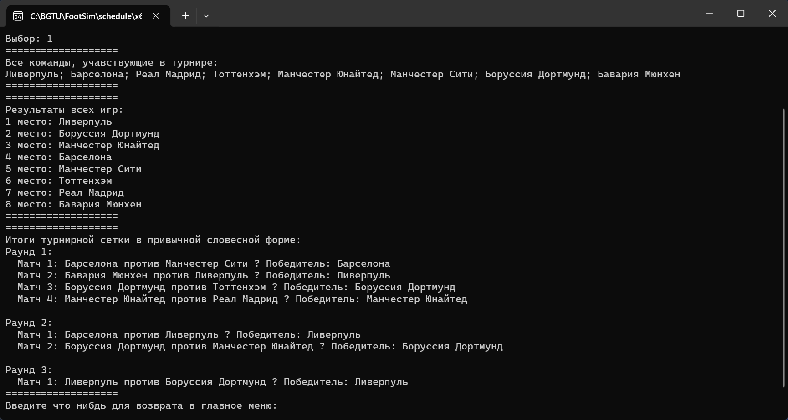
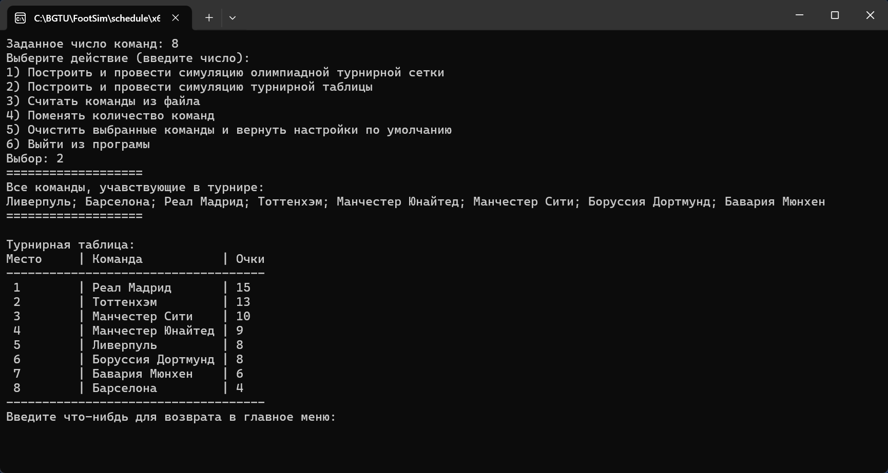
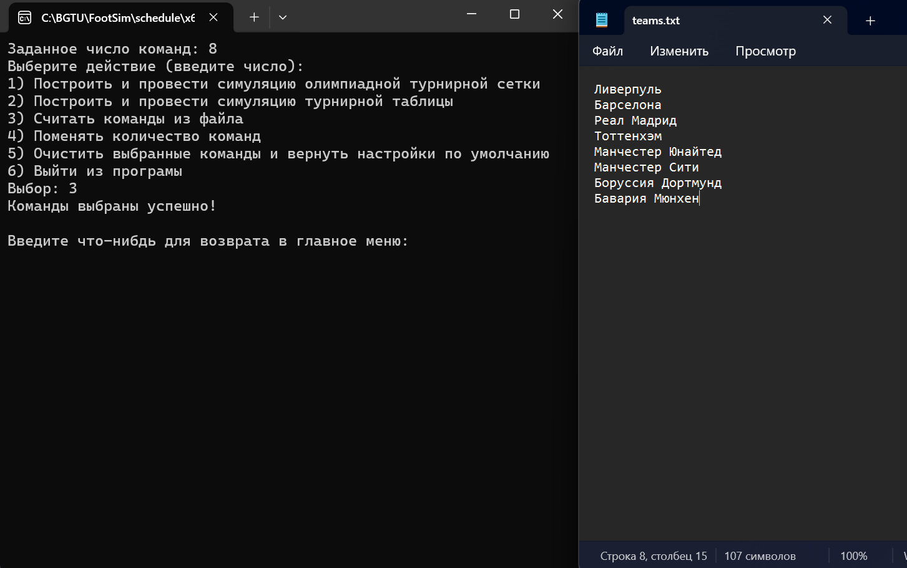

# FootSim

**FootSim** – это консольный симулятор футбольного турнира, написанный на C++.  
Проект реализует два формата проведения соревнований:
- **Турнирная сетка** (олимпийская система с выбыванием)
- **Турнирная таблица** (каждый играет с каждым)

Этот проект был создан в рамках учебной работы и представляет собой законченный пример симуляции турнира с генерацией команд, обработкой пользовательского ввода и файловым вводом.

---

## 🛠️ Возможности

- Генерация случайных команд по числу участников
- Импорт команд из файла (`teams.txt`)
- Проверка корректности числа команд (должно быть степенью двойки для сетки)
- Случайное распределение победителей и проигравших
- Поддержка русского языка в консоли (на Windows)
- Вывод результатов:
  - В виде таблицы с очками
  - В виде сетки с указанием победителей
- Удобное меню в командной строке

---

## 📸 Скриншоты

### 🎯 Турнирная сетка (олимпийская система)

### 🏆 Турнирная таблица

### 📂 Загрузка команд из файла

---

## ▶️ Как запустить

1. Откройте проект в **Visual Studio**.
2. Соберите и запустите проект как обычное консольное C++ приложение.
> ⚠️ Если вы хотите использовать собственные команды, измените файл `teams.txt`, указав по одной команде на строку (например, 8 строк). Количество команд должно быть степенью двойки **для режима "турнирная сетка"**.

---

## 🧱 Структура проекта

Проект состоит из одного `.cpp` файла и не требует сторонних библиотек. Используются только стандартные заголовки C++: `<iostream>`, `<vector>`, `<string>`, `<fstream>`.

---

## ⚠️ Ограничения

- Работает корректно на Windows.
- Симуляция полностью случайна – проект предназначен для учебных целей, а не для анализа настоящих матчей.
- Кодировка ввода и вывода – Windows-1251 (ANSI).

---

## 📚 Лицензия

Этот проект распространяется под лицензией MIT. См. файл [LICENSE](LICENSE) для подробностей.